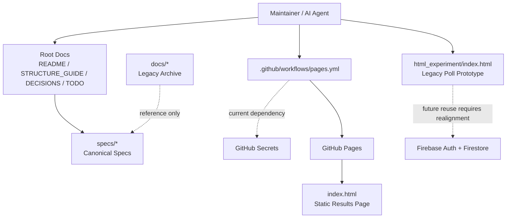

# アーキテクチャ図

```mermaid
flowchart TD
    Maintainer[Maintainer / AI Agent]
    RootDocs[Root Docs<br/>README / STRUCTURE_GUIDE / DECISIONS / TODO]
    Specs[specs/*<br/>Canonical Specs]
    Archive[docs/*<br/>Legacy Archive]
    Workflow[.github/workflows/pages.yml]
    Secrets[GitHub Secrets]
    Pages[GitHub Pages]
    PublicPage[index.html<br/>Static Results Page]
    Prototype[html_experiment/index.html<br/>Legacy Poll Prototype]
    Firebase[Firebase Auth + Firestore]

    Maintainer --> RootDocs
    RootDocs --> Specs
    Archive -. reference only .-> Specs

    Maintainer --> Workflow
    Workflow --> Pages
    Workflow -. current dependency .-> Secrets
    Pages --> PublicPage

    Maintainer --> Prototype
    Prototype -. future reuse requires realignment .-> Firebase
```
