# Firebase / Firestore 概要メモ

この文書は、`ai-workshop-vote` で使っていた Firebase / Firestore 構成を、復習しやすいように図解付きで整理したものです。

- 元になった会話: `ChatGPT-Firebase Firestore確認支援.md`
- 追記元の会話: `ChatGPT-Firebase Firestore確認支援 (1).md`
- 作成日: 2026-04-04
- 位置づけ: 理解用の補助資料。正史仕様ではありません

## ひとことで言うと

今回の構成は、**HTMLそのものは GitHub Pages で公開し、投票結果の保存先だけ Firebase / Firestore を使っていた**、というものです。

つまり、Firebase に HTML を置いて公開していたのではなく、**公開ページの裏側のデータ置き場として Firebase をつないでいた**のが本質です。

## 全体像

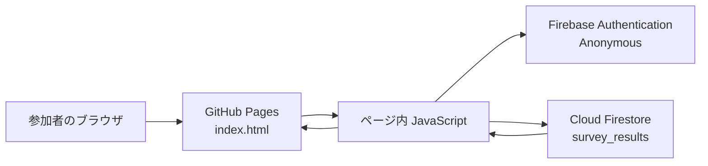

意味はこうです。

- 参加者は URL を開く
- 表示されるページ本体は `index.html`
- その `index.html` の中の JavaScript が Firebase に接続する
- Firebase の中でも:
  Authentication は「誰として入るか」
  Firestore は「データをどこに置くか」
- 投票した結果が Firestore に保存される
- 別の端末で開いているページもその変化を見て、リアルタイム表示できる

## 役割を分けると

### 1. GitHub Pages

見た目のページを置く場所です。

- HTML
- CSS
- JavaScript

今回でいうと、ここにあるのが `index.html` です。

つまり、GitHub Pages は「ページそのものを見せるサーバー」です。

### 2. Firebase Authentication

そのページから Firebase に入るための入館証です。

今回は `Anonymous` が有効でした。これは、

> ログイン画面は出さないけど、とりあえず Firebase 的には 1 人の利用者として扱う

という仕組みです。

なので参加者は Google ログインなどをしていなくても、内部的には Firebase に入れていました。

### 3. Cloud Firestore

投票結果を置いておくデータベースです。

今回見えていた `survey_results` はこれです。たとえば次のような値を保存していました。

- `votes_1: 4`
- `votes_2: 11`
- `votes_3: 7`
- `votes_4: 1`

つまり、

> 見た目のページは GitHub Pages  
> 中身の数字は Firestore

でした。

## あなたがやっていた処理の流れ

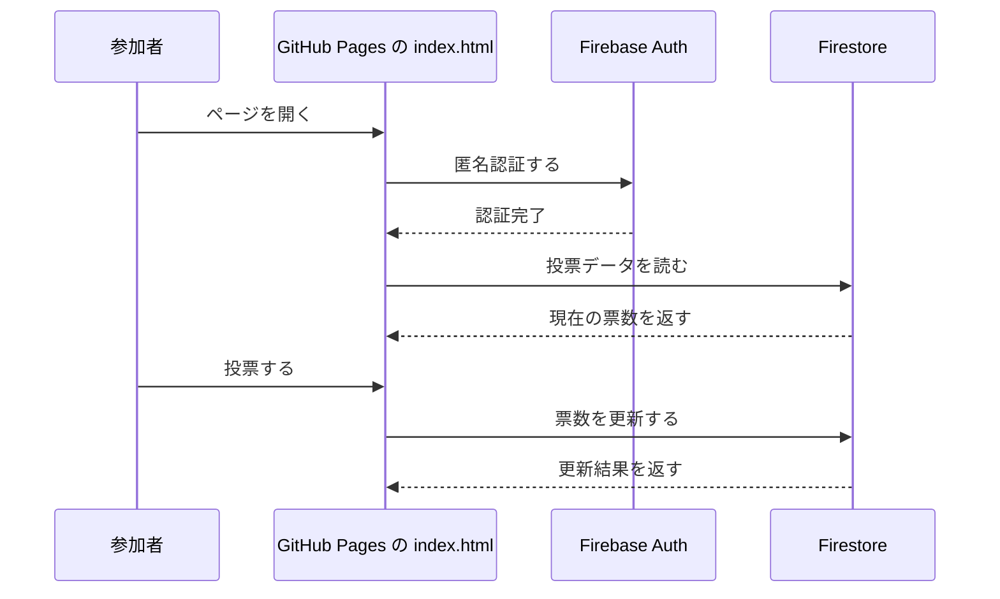

つまり、

1. ページを開く
2. ページ内の JavaScript が Firebase に接続
3. 匿名認証で入る
4. Firestore の投票データを読む
5. 参加者が投票
6. Firestore の数字が更新
7. 他の端末にも反映

こういう構造でした。

## `index.html` の中で実際に何が起きていたか

ここからは、概念説明ではなくコードレベルの話です。  
ページの中では次の順番で処理が進んでいました。

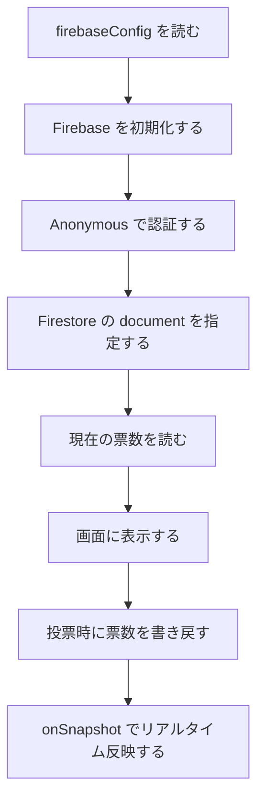

### 1. Firebase 初期化

まず、ページは接続先の Firebase プロジェクトを知る必要があります。

```js
const firebaseConfig = {
  apiKey: "AIza....",
  authDomain: "...firebaseapp.com",
  projectId: "ai-workshop-vote"
};
```

これは要するに、

> どの Firebase プロジェクトに接続するかの住所

です。

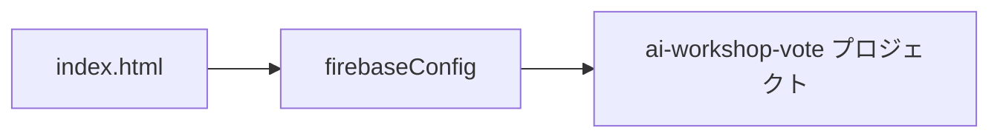

つまり HTML は、

> `ai-workshop-vote` という Firebase に接続する

と宣言しているだけです。

### 2. Firebase に接続する

```js
const app = initializeApp(firebaseConfig);
const db = getFirestore(app);
const auth = getAuth(app);
```

ここで起きていることは次の通りです。

- `initializeApp(...)`: Firebase 全体への接続を作る
- `getFirestore(app)`: Firestore を使う準備をする
- `getAuth(app)`: Authentication を使う準備をする

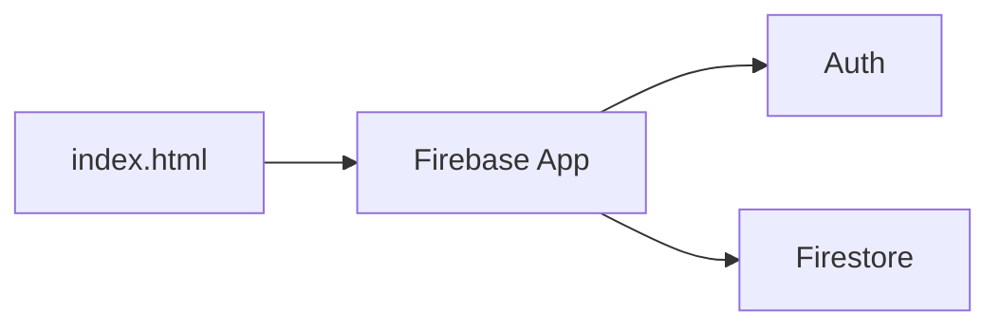

### 3. 匿名認証する

```js
signInAnonymously(auth);
```

これは、

> ユーザー名なしで、とりあえず 1 人の利用者として入る

という意味です。

これがなかったら、Firestore にアクセスできない構成でした。  
これがあったので、ページを開いた人はログイン画面なしで DB に入れました。

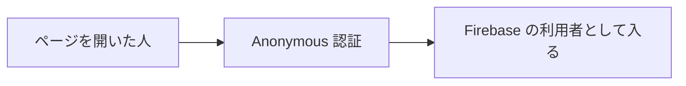

### 4. Firestore の場所を指定する

```js
const ref = doc(db, "artifacts", appId, "public", "survey_results");
```

これは、

> どのデータを読むか

を指定しています。

実際のパスの意味はこうです。

```txt
artifacts / ai-workshop-vote / public / survey_results
```

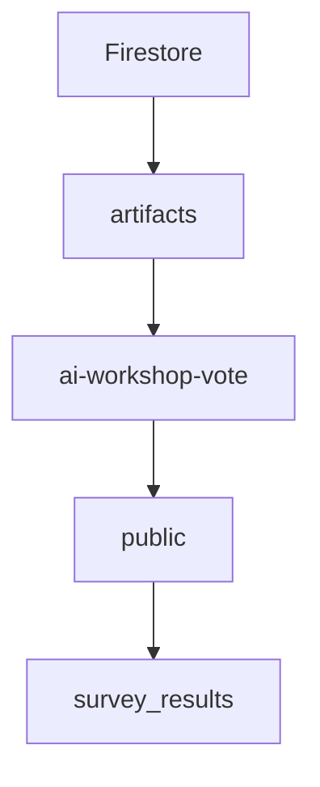

ここに票数が入っていました。

### 5. データを読む

```js
const snap = await getDoc(ref);
const data = snap.data();
```

これは、

> 今の投票結果を取得する

という処理です。

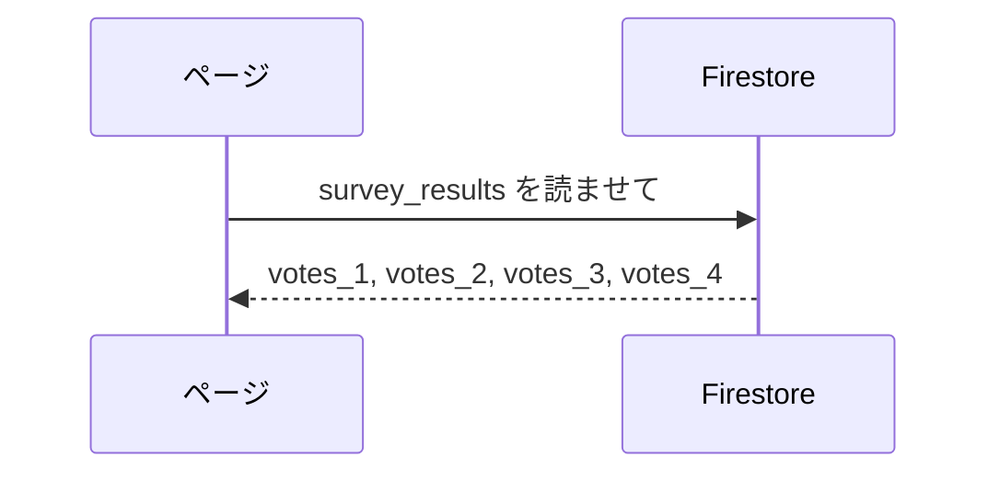

### 6. 画面に表示する

```js
document.getElementById("result").innerText = data.votes_1;
```

取得した数字を画面の表示に流し込むと、ユーザーが見る票数になります。

### 7. 投票を書き込む

```js
await updateDoc(ref, {
  votes_1: data.votes_1 + 1
});
```

これは、

> 票を 1 増やして保存する

という意味です。

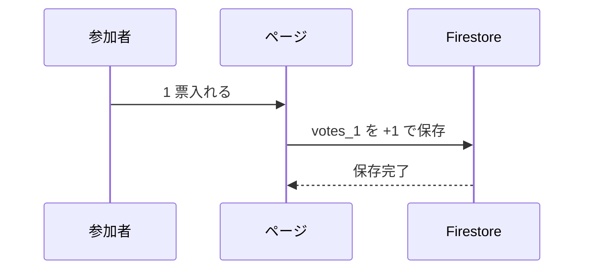

### 8. リアルタイムで更新する

```js
onSnapshot(ref, (doc) => {
  // 自動更新
});
```

これは、誰かが投票すると全員の画面を自動更新するための仕組みです。

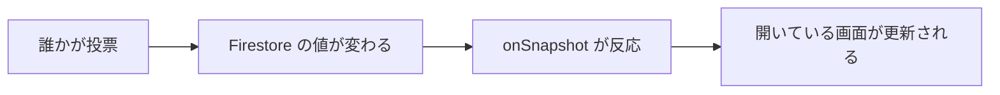

### コードレベルで一言にまとめると

今回あなたがやっていたのは、

> HTML から直接クラウド DB を叩くリアルタイムアプリ

でした。

## 「Firebase に HTML を乗せた」のか

今回の理解としては、基本は NO です。

正しくはこうです。

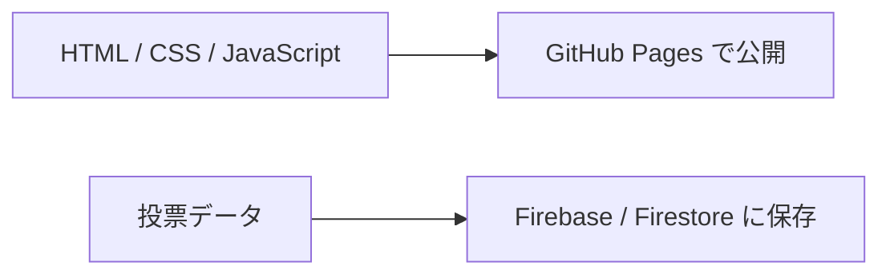

つまり、

- HTML は GitHub Pages 側
- Firebase は裏側サービス

です。

ただし Firebase には Hosting という機能もあるので、Firebase に HTML を置いて公開する構成もあります。  
でも今回のケースは、**GitHub Pages で公開して、Firebase は DB 用途**でした。

## なんで外部から入れる状態だったのか

ここが今回いちばん大事です。

理由は 2 つ重なっていました。

### 1. Anonymous 認証が有効だった

つまり、ページを開いた人はログイン画面なしで Firebase に入れました。

### 2. Firestore Rules が test mode のままだった

見えていた Rules は、要するにこういう意味でした。

> 2026-04-05 までは、DB 全体を読んでも書いてもいい

なので、ページの中の JavaScript が Firestore に接続できていたし、逆に言うと、その接続情報を持つクライアントからは外部アクセス可能な状態でした。

図にするとこうです。

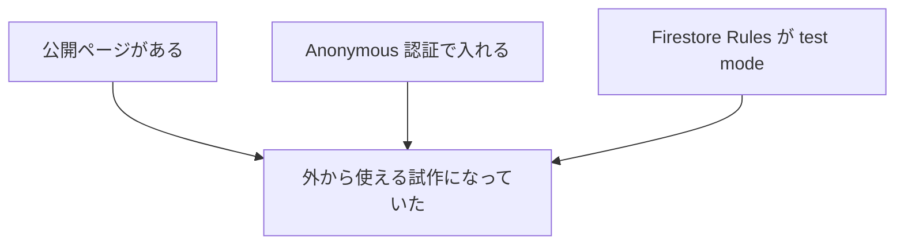

つまり、

- ページが公開されている
- 認証も匿名で通る
- ルールも広く開いている

この 3 点セットで、**外から使える試作**が成立していました。

## 何がどう危険だったのか

コードレベルで見ると、危険だった理由はさらに明確です。

### 1. Anonymous 認証が ON だった

```txt
ページを開く
-> 自動で Anonymous 認証
-> Firebase に入れる
```

つまり、ページを開いた人は誰でも Firebase に入れる状態でした。

### 2. Firestore Rules が test mode だった

```txt
入れた人
-> survey_results を読む
-> survey_results を書く
```

つまり、入れた人はかなり広く DB を触れる状態に近かったわけです。

この 2 つが重なると、

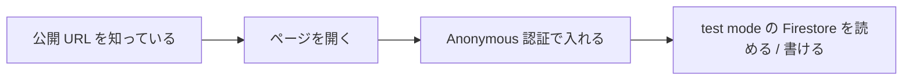

要するに、

> URL を知っている人は全員 DB を触れる状態

になり得ました。

## たとえ話

今回の構成は、たとえるならこうです。

### GitHub Pages

店の入口と看板

- みんなが見る場所
- ページの見た目

### Firebase Authentication

入館証の受付

- 誰が入るかをざっくり識別
- 今回は「名前を書かなくていい簡易受付」

### Firestore

店の奥の集計ノート

- 投票結果の数字が書いてある
- みんなの投票で数字が増える

そして今回の問題は、

> 店の奥の集計ノートが、期間限定でかなりゆるく開いていた

ということです。

## 今回の状態を一文で言うと

**GitHub Pages で公開した HTML ページが、Firebase の匿名認証を使って Firestore の投票データを読み書きしていた。しかも Firestore のルールが test mode だったので、外部から使える状態が続いていた。**

## なんでメールが来たのか

Firebase は test mode を長く放置すると危ないので、

> このままだと危険だから、あと 1 日でクライアントアクセスを止めるよ

と警告してきた、という理解でよいです。

これは Firebase 側が、

> 試作のまま本番みたいに使っていないか

を警戒している状態です。

## この構成の名前

この構成は、かなりざっくり言うと

> クライアント直 DB 型

あるいは

> サーバーレスでクライアントから Firebase を直接叩く構成

です。

中間の API サーバーを置かず、ブラウザの JavaScript がそのまま Firebase と話す形です。

## この構成のメリットとデメリット

### メリット

- サーバーを別に用意しなくてよい
- 試作をかなり速く作れる
- リアルタイム同期を比較的簡単に実現できる

### デメリット

- ルールをミスると今回のように危険になる
- セキュリティ設計がアプリコードではなく Rules に強く依存する
- 試作では速いが、本番用途では設計の粗さがそのまま事故につながりやすい

## 次に同じことをやるなら

もし同じような投票ページをまた作るなら、最低でも次のどちらかを意識した方がよいです。

### 1. Firebase を使い続けるなら Rules を最初からちゃんと絞る

- 読める範囲を限定する
- 書ける条件を限定する
- test mode を放置しない

### 2. より安全にしたいなら API サーバー経由にする

ブラウザが直接 DB を触るのではなく、

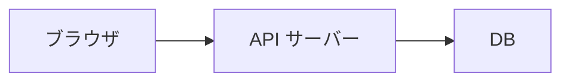

という形にすると、認証や書き込み制御をサーバー側で持てます。

試作の速さは少し落ちますが、設計の自由度と安全性は上がります。

## 今回閉じようとしているもの

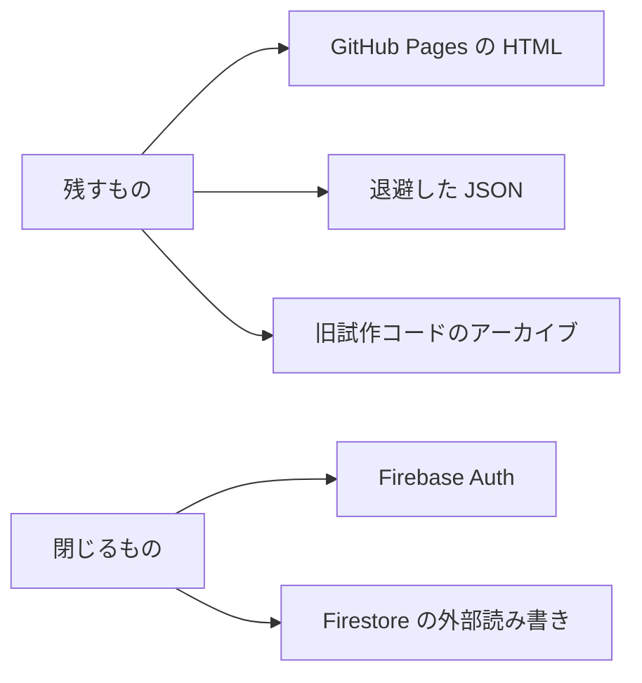

つまり、

- 残すもの:
  GitHub Pages の HTML
  退避した JSON
  旧試作コードのアーカイブ
- 閉じるもの:
  Firebase Auth
  Firestore の外部読み書き

です。

## 今回の理解として持っておくとよいこと

### Firebase は「ページ本体」ではなかった

ページ本体は GitHub Pages でした。

### Firebase は「裏の機能」だった

- 認証
- データ保存
- リアルタイム同期

### 危険だったのは HTML より裏の DB 設定だった

HTML が悪いというより、**HTML からつながる Firestore が test mode だった**のが問題でした。

### 閉じても HTML は残せる

HTML と Firebase は別物です。  
HTML ファイルを残しても、Firebase 接続を止めれば「ただの旧試作」として残せます。

## 最後に一枚でまとめる図

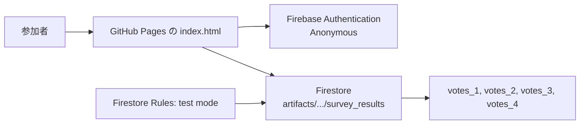

この図の読み方はこうです。

- 参加者は GitHub Pages 上の `index.html` を見る
- そのページが Firebase に接続する
- 匿名認証で入る
- Firestore の `survey_results` を読む・書く
- その Firestore は test mode Rules で開いていた
