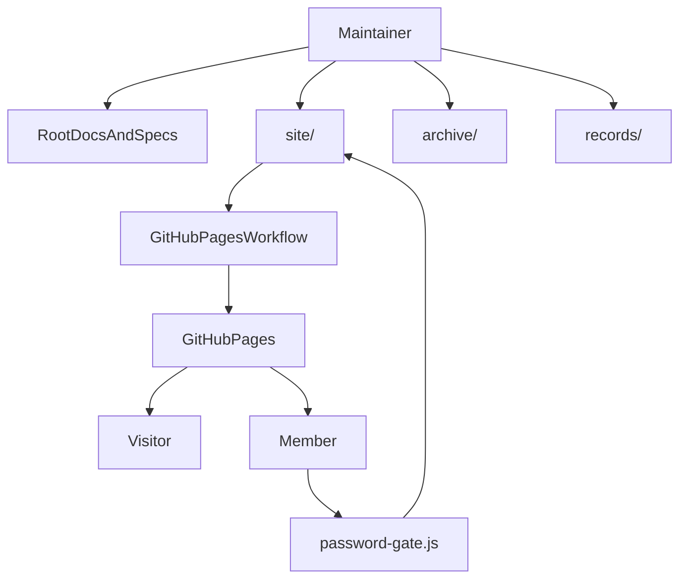

# アーキテクチャ図

```mermaid
flowchart TD
  maintainer[Maintainer]
  docs[RootDocsAndSpecs]
  site[site/]
  archive[archive/]
  records[records/]
  workflow[GitHubPagesWorkflow]
  pages[GitHubPages]
  visitor[Visitor]
  member[Member]
  gate[password-gate.js]

  maintainer --> docs
  maintainer --> site
  maintainer --> archive
  maintainer --> records
  site --> workflow
  workflow --> pages
  pages --> visitor
  pages --> member
  member --> gate
  gate --> site
```
